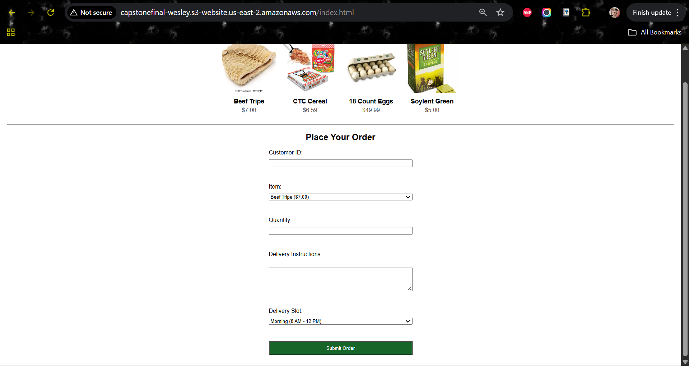
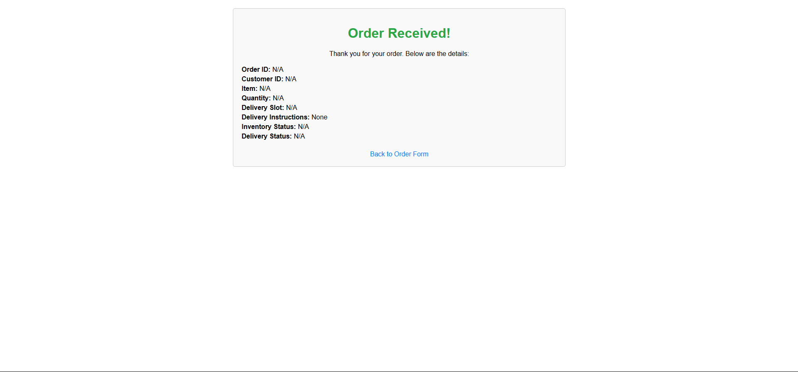
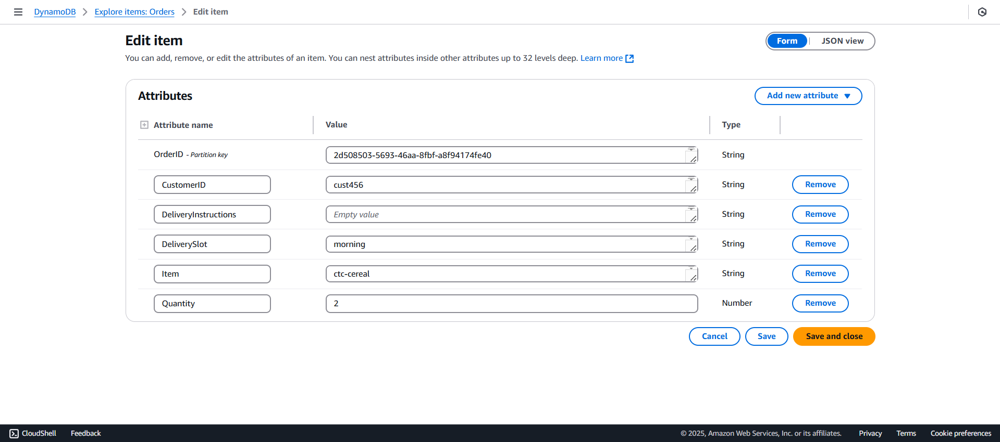

Steps

1. Clone Repository:

git clone https://github.com/your-username/CapstoneFinal.git
cd CapstoneFinal

2. Set Up S3:
Create bucket capstonefinal-wesley in us-east-2.
Enable static website hosting (index: index.html, error: index.html).

**Set bucket policy for public read:**

{
    "Version": "2012-10-17",
    "Statement": [
        {
            "Effect": "Allow",
            "Principal": "*",
            "Action": "s3:GetObject",
            "Resource": "arn:aws:s3:::capstonefinal-wesley/*"
        }
    ]
}
##
Upload frontend/ files: index.html, confirmation.html, script.js, styles.css.
3. Set Up DynamoDB:
Create Orders table in us-east-2 with partition key OrderID (String).
4. Set Up Lambda:
Create function CapstoneFinalOrderProcessor in us-east-2 (Node.js 20.x).
Add IAM role with permissions for DynamoDB (dynamodb:PutItem) and CloudWatch Logs.
5. Zip backend/:
cd backend
npm install
zip -r ../lambda.zip index.js package.json node_modules
Upload lambda.zip and set handler to index.handler.
6. Set Up API Gateway:
Create REST API CapstoneFinalAPI.
Add POST method on /orders, integrate with Lambda.
Deploy to stage prod (URL: https://fejipopgpe.execute-api.us-east-2.amazonaws.com/prod/orders).
7. Set Up CI/CD:
8. Add GitHub Actions workflow (.github/workflows/deploy.yml).
9. Store AWS credentials in GitHub Secrets: AWS_ACCESS_KEY_ID, AWS_SECRET_ACCESS_KEY, AWS_REGION (us-east-2).

**Screenshots:**
index.html: 
confirmation.html: 
DynamoDB sample order: 

Repository Structure:
CapstoneFinal/
├── .github/workflows/
│   └── deploy.yml
├── backend/
│   ├── index.js
│   ├── mock-erp-tms.json
│   ├── package-lock.json
│   ├── package.json
│   └── node_modules/
├── frontend/
│   ├── confirmation.html
│   ├── index.html
│   ├── script.js
│   └── styles.css
├── tests/
│   ├── test-report.md
├── README.md
├── READMEsetup.md
├── architecture.md
├── image-1.png
├── image-2.png
│── image.png